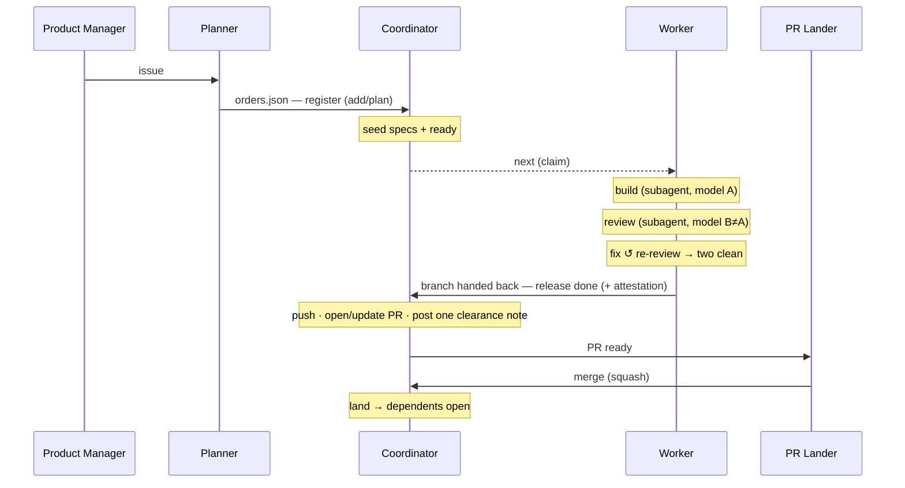

# The Nightshift workflow

How one unit of work travels from an idea to a merged, landed commit — and which
role owns each step. This is the operational spine the tools (`turnstile`,
`nightshift`, `octoshift`) and the skills (`nightshift-coordinator`,
`nightshift-worker`, `nightshift-builder`, `nightshift-reviewer`) serve. Read
[`nightshift.md`](nightshift.md) for the architecture, [`octoshift.md`](octoshift.md)
for the GitHub membrane, and the `nightshift-reviewer` skill for the review gate;
this note is the thread that ties them together.

## What this is in service of

Nightshift lets one operator direct many coding agents without spending their
attention on mechanics. It is a **loose harness**: where a coding agent's own harness
(Copilot CLI, Claude Code) tightly wraps one model's every turn, Nightshift sits above
many such harnesses and coordinates them through state — leases, orders, directives —
never their inner loops. **Loosely overlaid; strictly gated.** It touches nothing about
how an agent thinks and everything about which work flows and who may act: the coupling
between roles is loose, but the boundaries (claim, `check`, two clean reviews, `paths`,
land, escalate) are hard gates. That is what buys strong outcomes without step-level
supervision.

Four levels of control are the point; each pairs something to hold onto with the part
of the machine that holds it:

- **Control who posts as you — and how much.** *Centralize the GitHub surface.* All
  pushes, PRs, and comments go through the coordinator alone — under your account or a
  distinct bot identity — so the one place that touches GitHub is dialable, from
  fully-by-hand toward automated as you grant autonomy. ([`octoshift.md`](octoshift.md)
  owns that identity boundary.)
- **Scale execution to whatever the incoming work allows.** *A strong planner.* It
  parcels a plan into sequenced and parallel orders and — with visibility into GitHub
  merges — keeps the frontier moving, so work continues when `main` crosses a boundary
  of consistency.
- **Hold a high-confidence engineering bar.** *A strong coordinator.* It gates the work
  against what the project values; poor compliance wastes time and tokens but never
  reaches GitHub.
- **Reduce time spent tending execution.** *Strong skills and specs.* Planner and
  coordinator post on issues that need clarity; the product manager engages directly on
  the workflows and product shapes that need real tradeoff decisions. The clearer the
  guidance, the less anyone hovers over a running agent.

## Summary

The unit of work is an **order** — one landable PR, bound to at most one issue.
An order is claimed by one worker, built and reviewed to a clean adversarial
verdict, opened as a PR and cleared by the coordinator, merged, and **landed** —
at which point its dependents open. A **plan** (`orders.json`) is a DAG of orders
for a feature; the `after` edges express which orders must land before others can
start.

**Roles are responsibilities, not processes.** A role names *what* work is done and
its boundaries — build versus review, who writes to GitHub, which model runs — not
how many processes call `nightshift`. Nightshift has no "human" role and no "AI"
role; any role can be filled by a person or an agent, and one session can fill
several — Planner and Coordinator commonly collapse, and a worker builds and
reviews within its own session (via subagents). **One collapse never happens: a
Worker is always a separate instance from the Coordinator/Planner.** The
coordinator never claims, builds, reviews, or spawns workers — workers are
independent sessions that `join` and `next` on their own. The invariants hold
regardless of the split: the builder never reviews its own work, the reviewer is a
different model than the builder, and only the coordinator writes to GitHub.

Because roles can be distinct sessions — or distinct machines — they do not talk
directly. **They coordinate through Nightshift/Turnstile state.** An escalation a
worker raises surfaces to the coordinator as state, read off the board like every
other signal.

This is the accountability story made operational: direction-setting (Product
Manager, Planner) and the merge decision (PR Lander) are deliberate acts;
everything between a committed plan and a cleared PR runs without anyone spending
attention on mechanics — and without anyone's name on an uninterpretable storm of
contributions.

## The five roles

Any role can be filled by a person or an agent; most sessions on a machine are
workers. Each role's authoritative guidance lives in its skill.

| Role | Owns | Skill |
|---|---|---|
| **Product Manager** | The expanding shape of the product: new issues, taste, and where existing features must be re-shaped or composed to enable a UX or a non-obvious whole. Sets direction. | — |
| **Planner** | Turns intent (often issues) into orders and registers them with nightshift. | `nightshift-coordinator` |
| **Coordinator** | Keeps local work moving. First-level escalation with decision authority. Pushes worker branches, creates and updates PRs, and posts the one clearance note. Curates issues — files new ones, retires stale ones. | `nightshift-coordinator` |
| **Worker** | Claims one order and takes it to a reviewed branch (handed back for the coordinator to push) — building it *and* reviewing it, spawning `nightshift-builder` / `nightshift-reviewer` subagents as an optimization. | `nightshift-worker` |
| **PR Lander** | Holds merge authority; keeps sequenced PRs flowing; may be on another machine or a phone. | — |

## Where the gate protocol matters

`nightshift`'s claim/lease/check protocol matters **between distinct participants
that no one is watching**. Independent workers — headless, or on another machine —
call `next`/`check`/`release` themselves; nobody supervises them, the lease does. A
worker that dies stops renewing, and its order returns to the pool. That
recovery-by-lease is why the protocol exists. Between a worker and its own subagent
the protocol is unnecessary — progress flows back through the subagent channel
intrinsically; between a worker and the coordinator it is the comms channel.

## The spine: the life of one order



### 1 — Shape and plan (Product Manager, then Planner)

The product manager defines the change as issues — a feature to add, or a
taste/re-shape note where existing features must adapt to enable a UX or a composed
scenario. The planner turns that intent into orders and registers them. The
**standard** (a design note precise enough that a worker can check its own work
against it) and the **`orders.json`** plan are committed to `main` — the
*authorization root*; nothing is dispatchable that was not first approved into the
repo. The planner files one issue per order; the order's `issue` field points at it.
*(Planner and Coordinator are commonly the same session — but never the same
session as a Worker, which is always a separate instance.)*

```
nightshift add orders.json          # one-shot seed (idempotent)
nightshift plan --plan orders.json  # live controller: seed, then reconcile until stopped
```

`plan` seeds an immutable `spec` per order and a `/ready/*` row for every order
whose dependencies have all **landed**, and keeps that frontier current as orders
land — no manual re-run.

### 2 — Build and review (Worker)

A worker joins the shift and claims one order:

```
nightshift join
nightshift next            # blocks until one ready order is claimed, exclusively
```

`next` hands back one order, mints its branch name `nightshift/{plan}/{order}`, and
records it in Turnstile. In **its own worktree** cut from fresh `origin/main` — and
re-reading its guidance (SKILL.md + `AGENTS.md`) every order, which makes a
long-lived worker self-healing — the worker builds and reviews the order. It may do
both directly, or spawn `nightshift-builder` / `nightshift-reviewer` subagents — an
optimization that preserves its context window and supplies model diversity, not a
separate role. The `nightshift-worker` skill is the authoritative account; the shape
below is the summary:

1. **Build.** Either directly, or by spawning a builder subagent (which reads the
   `nightshift-builder` skill). The change touches only the order's `paths`, and
   `nightshift check` runs before every commit — that renews the lease, the forcing
   function that proves the claim is alive.
2. **Review.** Run the adversarial gate — **two clean reviews from two different
   models** on the final head. A worker using subagents spawns a reviewer subagent
   with a model *different* from the builder's; a worker not using subagents sends
   the review to a *different* worker (it cannot review its own build). Reviewers
   classify findings **blocking / non-blocking / pre-existing**: blocking findings go
   back to the **builder** to fix (a new commit is a new head and a fresh round; the
   gate passes only when both models are clean on the same, final commit), while
   non-blocking and pre-existing findings are carried to the coordinator to file as
   follow-up issues rather than held against this order.
3. **Release.** The worker hands the committed branch back and reports it:

   ```
   nightshift release --status done   # "submitted, awaiting merge" (+ review attestation)
   ```

`done` does **not** advance the DAG — only `land` does. The worker's deliverable is
a **reviewed branch** (committed, not pushed) plus the review attestation (the models
and rounds). The worker never pushes, opens a PR, comments, or merges — it hands its
work *inward*, to a branch and to Turnstile; the coordinator pushes it.

If the gate will not converge — four rounds without two clean — the worker does not
keep looping. It **escalates to the coordinator** (§Escalation).

### 3 — Open and clear the PR (Coordinator)

The coordinator sees the released order on the board (`nightshift where`/`roster`),
**pushes the worker's branch to origin**, and creates or updates the PR from it. It
posts exactly **one** clearance note — the attestation the worker produced, nothing
more:

```
✅ Adversarial review clear — two independent reviews.

| Model | Rounds |
| --- | --- |
| claude-opus-4.8 | 1 |
| gpt-5.3-codex   | 1 |
```

The deliberation — findings, fixes, re-reviews — never appears on the PR. *GitHub
carries decisions; git carries deliberation.* **Only the coordinator writes to
GitHub**: this keeps the public surface coherent and keeps a dozen workers from each
narrating on the repo.

When the two clean reviews were hard-won — a long loop that finally converged, or
every round ran the same paired models — the coordinator may commission **one more
review from a third model** that was not one of the final two before it clears. A
fresh model on a much-revised change sometimes catches something new; the extra time
is cheaper than shipping a bad PR.

### 4 — Merge and land (PR Lander, then Coordinator)

The **PR Lander** holds merge authority and merges (squash). This is the one
deliberate act kept out of automation by default, and it is what keeps the pipeline
continuous: when PRs are sequenced, a stalled lander stalls every dependent. The
lander can be on another machine or watching from a phone.

`land` reflects the merge back into Nightshift:

```
nightshift land /plan/{plan}/order/{order}
```

`land` writes `state=landed`; the live `plan` controller then opens every order that
was `after` this one — a dependent going from blocked to ready with no one's touch
is the payoff. Today a bridge or the coordinator calls `land` after observing the
merge; [`octoshift.md`](octoshift.md) is the future membrane that watches merges and
calls `land` automatically. *(Merge authority and the `land` signal can be different
actors: the PR Lander merges, the coordinator/bridge lands.)*

## Many orders at once

The single-order spine matters because it composes. A plan's `after` edges make the
DAG the scheduler:

- **No `after`** → ready immediately.
- **`after: [op1]`** → opens the moment `op1` **lands**, not when its worker reports
  `done`.
- Two orders that both `after: [op1]` open in parallel and are claimed by two
  workers with no collision — distinct claims, distinct fences.

`paths` is each order's file scope and the conflict-avoidance contract: if two orders
would touch the same files, give the second an `after` on the first so a merge
conflict becomes a scheduling wait instead of a race. See
[`nightshift.md`](nightshift.md) §5 for the DAG-as-scheduler details.

## Escalation — the Coordinator's call

When a worker cannot converge — a review that will not reach two clean, or an order
whose premise is ambiguous — it escalates:

```
nightshift escalate --reason "review did not converge after 4 rounds: <findings>"
```

The escalation surfaces to the coordinator **as state**, never as direct chat — the
coordinator reads it off the board like every other signal. The coordinator is
**first-level escalation** and makes the call:

- **Converging → continue.** The work is on track; grant it **one more round**, not open-ended
  license to proceed. A fresh escalation is judged on its own.
- **Wrong design → abandon.** The order's premise is flawed. Retire it and file a
  new issue with a corrected design and a fresh set of slices. *(This is where the
  coordinator's issue-curation hat meets the product manager's shape-setting hat.)*
- **Wrong path → requeue.** The design is fine but the implementation went sideways.
  Return the order to the pool for reassignment, with updated guidance attached.
- **Not design-ready → send it back.** If the order keeps failing because the
  underlying issue was never shaped well enough to scale — not because the
  implementation slipped — pull it from the pipeline and **post on the issue** naming
  the design it still needs. This release valve keeps under-designed work from burning
  worker time and tokens; the product manager (or planner) reshapes it before it
  re-enters. The planner applies the same gate up front — an issue that is still a
  sketch never becomes orders.

`escalate` records `state=escalated`, which the reconciler treats as ineligible — the
order waits and is never silently reassigned. At night, with no coordinator awake, the
default is **halt and hold**.

## Rework — a submitted order goes back

Between `done` and `land` an order can need another pass: `main` moves — landing `op1`
breaks `op2`'s pre-land branch with a merge conflict or a red CI run — or a
coordinator-side check (the optional triple-check, say) rejects it. Either way the
coordinator sends it back with `rework`, the sibling of `land`:

```
nightshift rework /plan/9001/order/op2 --reason-file findings.md
```

`rework` flips the order from `done` to the non-terminal `changes-requested`, carrying
the reason/findings, and **leaves the branch and claim intact** — the re-claiming worker's
WORK packet arrives with `mode: rework`, so it **continues the existing branch** rather
than cutting a fresh one. The **builder** integrates `main` and hands back a new commit
(merging — not rebasing — a public branch, so prior commits and their reviews survive);
the coordinator pushes it. `done → land` is a retry loop, not a one-shot.

## Two systems of record

The workflow has exactly two sources of truth, and one translator between them:

- **Turnstile** is the **dispatch** truth: who claims what, what is ready, what has
  landed. Credential-free, local, GitHub-unaware.
- **GitHub** is the **merge** truth: what actually shipped.
- **Octoshift** (future) is the only component that reads one and writes the other —
  mapping a merged PR back to its order and calling `land`. Until it exists, the
  coordinator is that translator, by hand.

Nightshift itself never calls `gh` and never parses a PR. `land` is a pure primitive:
"this order shipped." It does not know a merge caused it.

## Invariants

1. **One order, one landable PR, one worker.** The claim unit, the branch, and the
   merge unit are the same thing.
2. **`landed`, not `done`, advances the DAG.** Dispatch is autonomous; the merge is
   the PR Lander's deliberate act.
3. **Only the coordinator writes to GitHub — and only it pushes.** Workers hand
   committed branches inward and report results; reviewers report verdicts. Nothing else
   touches origin or the public surface.
4. **The builder never reviews its own work; the reviewer is a different model.**
   Enforced with subagents by the worker choosing the reviewer's model, and without
   subagents by the review going to a different worker. A worker offered review of an
   order it built declines as a structurally invalid choice.
   *(Gap: a dedicated invalid-choice decline variant is not yet implemented.)*
5. **Roles coordinate through nightshift state, never direct chat.** An escalation is
   state the coordinator reads; the coordinator's decision returns as a directive.
6. **Nothing posts under a maintainer's identity as if hand-done.** The GitHub surface
   stays quiet and, when automated, wears a distinct bot identity.
